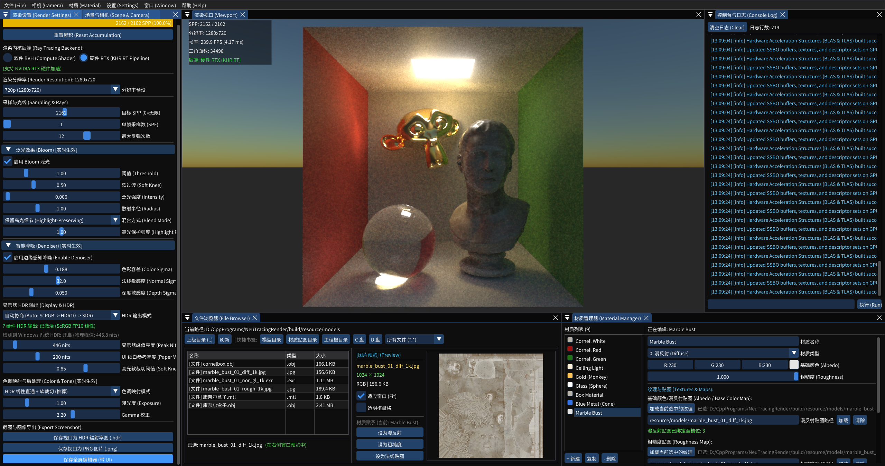

# NeuTracingRender (NeuVulkanRenderer_RayTracing)


一个基于 **Vulkan Compute Shader** 实现的高性能实时/渐进式路径追踪渲染器（Path Tracer），采用现代化 C++17 编写，集成了物理材质系统（PBR）、保边双边滤波降噪、多级泛光（Bloom）、Nishita 大气物理天空模型以及基于 Dear ImGui + SDL3 的实时编辑器界面。

---

## 更新日志 (Changelog)

### v1.2.0（2026-09-07）
- **随机数生成质量大幅提升**：引入 Murmur3 哈希（`murmur3Mix` + `initRng`）对 PCG4D 初始 seed 进行打散，消除低 SPP（1–4帧）下的结构性噪声条纹 Pattern。

### v1.1.0
- 硬件 RTX 光追管线（`VK_KHR_ray_tracing_pipeline`）、原生显示器 HDR 输出（ScRGB / HDR10）。

## 效果预览



---

## 核心特性

### 1. 双光线追踪内核后端 (Dual Ray Tracing Backends)
- **硬件 RTX 光追管线 (KHR Ray Tracing Pipeline)**：基于 Vulkan `VK_KHR_ray_tracing_pipeline` 与 `VK_KHR_acceleration_structure`，利用现代 GPU（如 NVIDIA RTX / AMD RDNA2+）硬件 RT Core 加速光线求交与 BVH 遍历。
- **通用 Compute Shader 软件光追**：纯计算着色器方案，内置 CPU SAH 扁平化 BVH，不依赖硬件光追专有扩展，可在几乎所有 Vulkan 1.2+ GPU 上流畅运行。
- **运行时无缝热切换**：可在编辑器界面中一键切换渲染后端，方便对比验证硬件光追与软件光追性能与结果。
- **渐进式采样与累加**：支持 Accumulation Buffer 渐进累加采样（SPP 累加计数），提供极佳的交互式预览与高清降噪出图体验。
- **物理景深 (Depth of Field)**：支持可调光圈半径（Aperture）与对焦距离（Focus Distance）的真实薄透镜景深模拟。

### 2. 显示器原生硬件 HDR 输出 (Display Native HDR)
- **宽色域与超高动态范围**：原生支持 Windows HDR 模式，自动协商或强制切换 **ScRGB (FP16 线性)** 与 **HDR10 (BT.2020 + ST 2084 PQ)** 输出。
- **双层离屏混合架构**：通过专用 GPU 复合着色器（Composite Pass），将高动态 HDR 渲染视口与 SDR ImGui 用户界面高保真精准合成，杜绝 UI 亮化刺眼或视口变暗。
- **动态物理标定调控**：支持白纸参考亮度（Paper White Nits）、峰值亮度（Peak Nits）与 Soft Knee 软膝高光滚降实时滑块调节。
- **工业级 HDR 图像导出**：视口支持直接保存为 Radiance `.hdr` 高动态范围辐射率图，完美保留真实场景光照强度。

### 3. 基于物理的材质系统 (PBR Materials)
- **多种材质模型**：
  - **Lambertian 漫反射**
  - **Metallic-Roughness 金属/粗糙度**
  - **Dielectric 玻璃折射与透射**（Fresnel 反射、可调 IOR 折射率）
  - **Emissive 面光源/发光材质**（支持颜色与发光强度实时调节）
- **丰富贴图通道**：支持 Albedo 基础色、Roughness 粗糙度贴图、Normal/Bump 法线凹凸贴图映射。

### 4. 物理天空与后处理管线 (Post-Processing & Sky)
- **Nishita 1993 大气散射天空**：支持太阳高度角（Elevation）、方位角（Azimuth）以及大气浑浊度参数实时调节。
- **保边双边滤波降噪 (Edge-Avoiding Bilateral Denoise)**：利用法线、深度与颜色导向缓冲实现低采样下的快速去噪。
- **多级物理泛光 (Physically Based Bloom)**：基于 Brightness Threshold -> 逐级 Downsample -> 逐级 Upsample 混合。
- **色彩与色调映射 (Tone Mapping)**：支持 ACES Filmic、Reinhard、线性 HDR 等多种算法，支持曝光度与 Gamma 实时调整。

### 5. 交互式编辑器与工具 (Editor & Tooling)
- **Docking 布局与界面**：集成 Dear ImGui 与 SDL3，支持面板自由停靠、材质实时编辑、场景树管理。
- **内置模型与文件浏览器**：自带 Wavefront OBJ 加载器与内置文件浏览器，支持一键切换预设康奈尔盒（Cornell Box）模型。
- **双模式相机控制器**：支持第一人称自由漫游（WASD + QE + 鼠标右键）与观察视角（Orbit）。
- **实用工具**：集成 spdlog 运行时控制台输出、视口 HDR/PNG 一键截图导出。

---

## 技术栈与第三方依赖

| 组件 | 用途 |
| :--- | :--- |
| **Vulkan 1.2+** | 底层跨平台图形与计算 API |
| **SDL3** | 窗口创建与多平台输入事件管理 |
| **Dear ImGui (Docking)** | 运行时图形用户交互界面 |
| **GLM** | 向量与矩阵数学库 |
| **spdlog / fmt** | 高性能日志与格式化输出 |
| **tinyobjloader** | OBJ 3D 模型格式解析（单头文件） |
| **stb_image / stb_image_write** | 贴图加载与截图导出（单头文件） |
| **nlohmann/json** | 配置与数据序列化（单头文件） |

---

## 快速构建指南

### 前置要求
1. **操作系统**：Windows 10/11 64-bit
2. **编译器**：支持 C++17 的编译器（如 MSVC 2019+ 或 MinGW-w64 GCC 10+）
3. **构建工具**：CMake 3.16+
4. **图形环境**：[Vulkan SDK](https://vulkan.lunarg.com/)（建议 1.3+）
5. **包管理器**：推荐使用 [vcpkg](https://github.com/microsoft/vcpkg) 管理依赖

### 使用 CMake + vcpkg 构建（以 MinGW 或 MSVC 为例）

1. **安装依赖项**（通过 vcpkg）：
   ```powershell
   vcpkg install imgui[docking-experimental-binding,vulkan-binding,sdl3-binding] sdl3 vulkan spdlog fmt glm --triplet x64-windows
   ```

2. **配置与构建工程**：
   ```powershell
   # 克隆仓库
   git clone https://github.com/dutou520/NeuVulkanRenderer_RayTracing.git
   cd NeuVulkanRenderer_RayTracing

   # 配置 CMake（请将 VCPKG_ROOT 替换为你的 vcpkg 实际路径）
   cmake -B build -S . -DCMAKE_TOOLCHAIN_FILE="$env:VCPKG_ROOT/scripts/buildsystems/vcpkg.cmake"

   # 开始编译
   cmake --build build --config Release
   ```

3. **运行程序**：
   ```powershell
   cd build
   ./NeuTracingRender.exe
   ```

---

## 控制与快捷键说明

| 操作 | 对应功能 |
| :--- | :--- |
| **按住鼠标右键 + 移动** | 旋转相机视角（Pitch / Yaw） |
| **W / A / S / D** | 前进 / 向左 / 后退 / 向右 |
| **E / Q** | 上升 / 下降 |
| **Shift** | 相机快速移动加速 |
| **菜单栏 -> 文件 -> 加载康奈尔盒** | 重新加载预设 Cornell Box 场景 |
| **菜单栏 -> 相机 -> 重置视角** | 将相机重置为经典康奈尔盒正交正视角 |
| **菜单栏 -> 文件 -> 保存截图** | 截取当前累加画质并保存为 `screenshot.png` |

---

## 目录结构说明

```plaintext
├── include/              # 核心头文件 (BVH, Camera, Scene, Material, PathTracerCore 等)
├── source/               # 核心实现代码与主入口
├── resource/             # 项目依赖资源
│   ├── fonts/            # 中文字体 (思源黑体)
│   ├── models/           # 默认 3D 几何模型 (cornelbox.obj)
│   ├── shaders/          # GLSL 源码与预编译 SPV (Compute Shader, Bloom, Denoise 等)
│   └── textures/         # 基础材质与法线贴图
├── docs/                 # 项目文档及展示图片
├── ThirParty/            # stb, tinyobjloader, nlohmann-json 等第三方头文件库
└── CMakeLists.txt        # CMake 自动化工程配置文件
```
